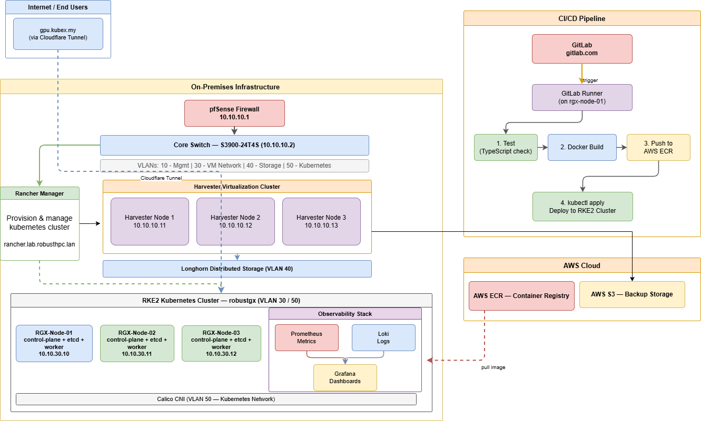

# Kubernetes Platform — gpu.kubex.my


A production-grade homelab built entirely from scratch — starting from bare-metal servers and a raw managed switch, ending with a live HTTPS application running on a self-managed Kubernetes cluster, secured through Cloudflare Tunnel with zero open inbound firewall ports.

The application is **Kubex**, a simulated GPU cloud marketplace where users browse GPU instances (RTX 4090, RTX PRO 6000 Blackwell, GB10 Superchip), view pricing, and deploy servers — modelled after platforms like vast.ai and TensorDock. Every layer of infrastructure is self-hosted and self-managed.

> **Live:** https://gpu.kubex.my
> **Full Documentation:** https://www.notion.so/370f5cca41248112ad22f06d5a35f8f6
> **GitLab (CI/CD):** https://gitlab.com/ikhmal/kubernetes-platform

---

## What This Demonstrates

This project covers the full platform engineering stack end-to-end:

| Skill Area | What Was Built |
|---|---|
| **Infrastructure as Code** | Terraform provisions VMs on Harvester HCI; Ansible bootstraps RKE2 and deploys the full monitoring stack |
| **Kubernetes** | Self-managed RKE2 cluster (3 nodes, all roles); Longhorn distributed storage; Calico CNI; NGINX ingress |
| **CI/CD** | 4-stage GitLab pipeline (test → build → push → deploy) with self-hosted runner; images pinned to commit SHA |
| **Observability** | kube-prometheus-stack + Loki + Promtail; node-exporter patched for RKE2 SELinux constraints |
| **Networking** | 4-VLAN segmentation (management / VM / storage / Kubernetes); pfSense firewall; managed switch config |
| **Security** | Zero open inbound ports via Cloudflare Tunnel; HTTPS on a custom domain without exposing the home IP |
| **Application** | Full-stack app (React + Node.js + PostgreSQL) containerised, deployed to Kubernetes, served to the internet |

---

## Architecture Diagram



---

## Tech Stack

| Layer | Technology | Detail |
|---|---|---|
| **Network** | pfSense + S3900-24T4S | Firewall, DHCP, DNS, 4-VLAN segmentation |
| **Virtualisation** | Harvester HCI | 3-node bare-metal HCI cluster (KubeVirt) |
| **Cluster Management** | Rancher | Manages Harvester + provisions RKE2 |
| **OS** | Rocky Linux 9.7 | All 3 RKE2 nodes (cloud-init provisioned) |
| **Kubernetes** | RKE2 | 3 nodes, all roles: control-plane + etcd + worker |
| **CNI** | Calico | Pod networking on VLAN 50 |
| **Storage** | Longhorn | Distributed block storage, 3x replication |
| **Observability** | Prometheus + Loki + Grafana | Metrics, logs, dashboards |
| **IaC** | Terraform + Ansible | VM provisioning + cluster bootstrap |
| **Frontend** | React + Vite + TypeScript + Tailwind CSS | 4 pages, served by nginx |
| **Backend** | Node.js + Express + Prisma | REST API on port 3001 |
| **Database** | PostgreSQL 16 Alpine | In-cluster, Longhorn PVC |
| **Containers** | Docker (multi-stage Dockerfiles) | Local dev via docker-compose |
| **Registry** | AWS ECR (ap-southeast-1) | kubex/frontend + kubex/backend |
| **CI/CD** | GitLab CI + self-hosted Runner | 4 stages, shell executor on rgx-node-01 |
| **Public Access** | Cloudflare Tunnel | HTTPS with custom domain, zero open inbound ports |
| **Backup** | AWS S3 | Harvester VM snapshots |

---

## Network Design

4 VLANs segment traffic across the infrastructure:

| VLAN | Name | Subnet | Purpose |
|---|---|---|---|
| 10 | Management | 10.10.10.0/24 | SSH, Rancher UI, switch admin |
| 30 | VM Network | 10.10.30.0/24 | RKE2 node traffic |
| 40 | Storage | 10.10.40.0/24 | Longhorn replication (isolated) |
| 50 | Kubernetes | 10.10.50.0/24 | Pod and service networking |

Each Harvester node has 2 NICs — `eno1` for management (VLAN 10) and `eno2` dedicated to storage (VLAN 40). This ensures Longhorn replication never competes with cluster traffic.

---

## Public Access via Cloudflare Tunnel

The live site at **https://gpu.kubex.my** is exposed through a **Cloudflare Tunnel** — no firewall ports are open on the router or switch. This is the same approach used by teams who want to publish internal services securely without a public IP or open inbound rules.

**How it works:**

```
Browser → Cloudflare Edge (HTTPS)
              ↓
         Cloudflare Tunnel (outbound-only connection from cluster)
              ↓
         cloudflared pod (inside Kubernetes)
              ↓
         NGINX Ingress → frontend-svc / backend-svc
```

The `cloudflared` daemon inside the cluster establishes a persistent outbound connection to Cloudflare's edge. Cloudflare terminates TLS, enforces the custom domain, and proxies traffic inward — the home network has no open ports at any layer.

**Benefits for this setup:**
- No dynamic DNS or port-forwarding rules on pfSense
- TLS certificate managed entirely by Cloudflare
- Home IP is never exposed in DNS
- Access control can be layered on via Cloudflare Access if needed

---

## Hardware

| Hostname | Model | CPU | RAM | Storage | Role |
|---|---|---|---|---|---|
| lab-rancher | Supermicro X10DRL-i | 44 cores | 16 GB | 2x 1TB SSD | Rancher Server |
| lab-hvst-01 | Supermicro X10DRL-i | 44 cores | 32 GB | 2x 1TB SSD | Harvester Primary |
| lab-hvst-02 | Supermicro X9DRL-EF | 40 cores | 32 GB | 2x 1TB SSD | Harvester Node |
| lab-hvst-03 | Supermicro X9DRL-EF | 40 cores | 32 GB | 2x 1TB SSD | Harvester Node |

---

## Project Structure

```
kubernetes-platform/
├── terraform/                       # VM provisioning on Harvester
│   ├── providers.tf                 # Harvester, Rancher, K8s, Helm providers
│   ├── variables.tf                 # Input variables with defaults
│   ├── main.tf                      # VM resources + cloud-init scripts
│   ├── outputs.tf                   # Node IPs and cluster info
│   ├── terraform.tfvars.example     # Template — copy and fill in your values
│   └── COMMANDS.md                  # Quick reference commands
│
├── ansible/                         # Cluster bootstrap and configuration
│   ├── site.yml                     # Master playbook (runs all below in order)
│   ├── gitlab-runner.yml            # GitLab Runner installation
│   ├── inventory/rke2.yml           # Node inventory (rgx-node-01/02/03 + IPs)
│   ├── group_vars/all.yml           # Shared variables
│   └── playbooks/
│       ├── 00a-prepare-nodes-longhorn.yml   # Install open-iscsi + nfs-utils
│       ├── 00-install-longhorn.yml          # Deploy Longhorn via Helm
│       ├── 01-deploy-monitoring.yml         # Deploy Prometheus + Loki + Grafana
│       └── 02-verify-monitoring.yml         # Health checks
│
├── frontend/                        # React + Vite + TypeScript + Tailwind CSS
│   ├── src/pages/                   # Home, GPUs, Pricing, Dashboard
│   ├── Dockerfile                   # Multi-stage: Node build → nginx serve
│   └── nginx.conf
│
├── backend/                         # Node.js + Express + Prisma
│   ├── src/
│   │   ├── index.ts                 # Express server, CORS, routes
│   │   └── routes/                  # /api/gpus, /api/instances, /health
│   ├── prisma/schema.prisma         # Database schema
│   └── Dockerfile                   # Multi-stage: build + prisma migrate
│
├── k8s/                             # Kubernetes manifests
│   ├── namespace.yaml               # kubex namespace
│   ├── configmap.yaml               # App config (PORT, FRONTEND_URL, DB name)
│   ├── frontend.yaml                # Deployment + Service (port 80)
│   ├── backend.yaml                 # Deployment + Service (port 3001) + initContainer
│   ├── postgres.yaml                # Deployment + Service + Longhorn PVC (5Gi)
│   └── ingress.yaml                 # NGINX ingress: /api → backend, / → frontend
│
├── docker-compose.yml               # Local development (postgres + backend + frontend)
└── .gitlab-ci.yml                   # 4-stage CI/CD pipeline
```

---

## Setup

### Prerequisites

- Harvester HCI cluster running with kubeconfig at `~/.kube/harvester-config`
- Rancher instance accessible at `https://rancher.lab.robusthpc.lan`
- Ansible and Terraform installed on your local machine
- AWS CLI configured with ECR access in `ap-southeast-1`

### 1. Provision VMs with Terraform

Terraform creates 3 Rocky Linux 9.7 VMs on Harvester. Node-01 bootstraps the RKE2 cluster; nodes 02-03 join automatically via cloud-init.

```bash
cd terraform
cp terraform.tfvars.example terraform.tfvars
# Fill in: Harvester kubeconfig path, Rancher token, RKE2 join token, SSH public key

terraform init      # Download providers
terraform plan      # Preview what will be created
terraform apply     # Provision all 3 VMs (takes ~5-10 min)
terraform output    # Print node IPs
```

**VM specs:** 4 vCPU · 8 GiB RAM · 100 GiB disk per node

### 2. Bootstrap Cluster with Ansible

Once VMs are up and RKE2 is running, Ansible configures storage and monitoring:

```bash
cd ansible

# Full stack — Longhorn + Prometheus + Loki + Grafana
ansible-playbook site.yml --extra-vars "grafana_admin_password=YourPassword"

# Run specific parts using tags
ansible-playbook site.yml --tags longhorn     # Storage only
ansible-playbook site.yml --tags monitoring   # Monitoring only

# Install GitLab Runner on rgx-node-01
ansible-playbook gitlab-runner.yml
```

### 3. Run Locally with Docker Compose

```bash
docker-compose up --build

# Frontend: http://localhost:80
# Backend:  http://localhost:3001
# Database: localhost:5432
```

The `depends_on: condition: service_healthy` ensures the backend waits for PostgreSQL to be ready before starting — the same pattern used in Kubernetes via `initContainer`.

### 4. Deploy to Kubernetes

CI/CD handles this automatically on every push to `main`. To deploy manually:

```bash
export KUBECONFIG=~/.kube/rke2-config

kubectl apply -f k8s/namespace.yaml
kubectl apply -f k8s/
kubectl rollout status deployment/frontend -n kubex --timeout=300s
kubectl rollout status deployment/backend -n kubex --timeout=300s
kubectl get pods -n kubex
```

---

## CI/CD Pipeline

Every push to `main` triggers the full pipeline. From `git push` to live at gpu.kubex.my in ~3–5 minutes.

```
git push → GitLab
               |
         GitLab Runner (self-hosted on rgx-node-01, shell executor)
               |
         ┌─────▼──────────────────────────────────────────────┐
         │  test     npx tsc --noEmit                          │  frontend + backend in parallel
         │  build    docker build -t $IMAGE:$SHA               │  frontend + backend in parallel
         │  push     aws ecr get-login-password | docker push  │  both images, SHA + latest tags
         │  deploy   kubectl apply -f k8s/ + rollout status    │  fails pipeline if unhealthy
         └────────────────────────────────────────────────────┘
               |
         Kubernetes pulls new image from ECR
               |
         Cloudflare Tunnel picks up the updated pod automatically
               |
         gpu.kubex.my updated live
```

**Key details:**
- Images tagged with `$CI_COMMIT_SHORT_SHA` — every running image is traceable to a specific commit
- `kubectl set image` with the commit SHA forces Kubernetes to pull the new image on every deploy (using `latest` alone does not)
- ECR pull secret recreated idempotently on every deploy (`--dry-run=client | kubectl apply`)
- `kubectl rollout status --timeout=300s` — pipeline fails if pods don't become healthy within 5 minutes
- Cloudflare Tunnel requires no pipeline steps — it stays connected to the cluster continuously and automatically routes to healthy pods

---

## Monitoring

| Service | Access | Purpose |
|---|---|---|
| Grafana | `http://10.10.30.10:30300` | Dashboards — node metrics, pod health, logs |
| Prometheus | `http://10.10.30.10:30090` | Metrics + PromQL queries |
| Loki | via Grafana → Explore | Log aggregation from all pods via Promtail DaemonSet |

**node-exporter SELinux patch:** RKE2 runs with SELinux enforcing. The default node-exporter DaemonSet fails to mount `/proc` and `/sys` on Rocky Linux 9.7 without explicit `privileged: true` and `type: spc_t` SELinux context. The Ansible playbook applies this patch automatically so all host-level metrics are collected correctly.

**Useful PromQL queries:**
```
# CPU usage per node
100 - (avg by(instance) (rate(node_cpu_seconds_total{mode="idle"}[5m])) * 100)

# RAM used %
(node_memory_MemTotal_bytes - node_memory_MemAvailable_bytes) / node_memory_MemTotal_bytes * 100

# Disk usage %
100 - (node_filesystem_avail_bytes{mountpoint="/"} / node_filesystem_size_bytes{mountpoint="/"} * 100)
```

**Loki log queries (in Grafana Explore):**
```
{namespace="kubex"}                          # All app logs
{namespace="kubex", app="backend"}           # Backend only
{namespace="kubex"} |= "error"              # Filter for errors
```

---

## Application

A GPU cloud marketplace with 4 pages:

| Route | Page | Description |
|---|---|---|
| `/` | Home | Hero section, live GPU availability widget, GPU tiers |
| `/gpus` | GPU Instances | Filterable marketplace (Entry / Pro / AI Workstation) |
| `/pricing` | Pricing | Per-second billing cards, hourly/monthly estimates, FAQ |
| `/dashboard` | Dashboard | Deployed instances view with live cost tracking |

**Backend API endpoints:**
- `GET /api/gpus` — GPU catalogue with pricing and availability
- `GET /api/instances` — User's deployed instances
- `GET /health` — Healthcheck (used by Kubernetes readiness probe)

---

## Kubernetes Resources

| Resource | Namespace | Detail |
|---|---|---|
| Deployment/frontend | kubex | React app, nginx, ECR image, readiness probe |
| Deployment/backend | kubex | Node.js API, initContainer waits for postgres |
| Deployment/postgres | kubex | PostgreSQL 16, Longhorn 5Gi PVC |
| Ingress/kubex-ingress | kubex | /api → backend-svc:3001, / → frontend-svc:80 |
| Deployment/prometheus | monitoring | 20Gi Longhorn PVC |
| Deployment/grafana | monitoring | 5Gi Longhorn PVC, NodePort 30300 |
| StatefulSet/loki | monitoring | 10Gi Longhorn PVC |
| DaemonSet/promtail | monitoring | Runs on all 3 nodes |

---

## Author

**Ikhmal** — Platform / Infrastructure Engineer

- GitHub: [Ikhmal-Hisyam-4/Kubernetes-Platform](https://github.com/Ikhmal-Hisyam-4/Kubernetes-Platform)
- GitLab: [gitlab.com/ikhmal/kubernetes-platform](https://gitlab.com/ikhmal/kubernetes-platform)
- Live: [gpu.kubex.my](https://gpu.kubex.my)
- Documentation: [Notion](https://www.notion.so/370f5cca41248112ad22f06d5a35f8f6)
